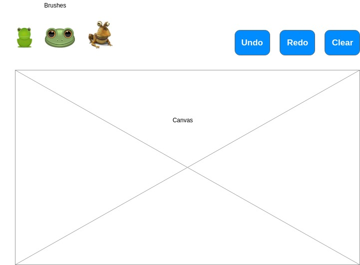

## Candy Paint

### Background

Candy Paint is an interative paint app that uses images of some of my favorite things (sun, oranges, tropical frogs, bunnies) as brushes.

### Functionality & MVP  

With Candy Paint, users will be able to:

- [ ] Paint on a canvas and clear a canvas (undo/redo/save options will be bonus features)
- [ ] Choose a brush from the preset options
- [ ] Add options for changing the size and opacity of the brushes
- [ ] Toggle between the different brush options available

In addition, this project will include:

- [ ] A production Readme

### Wireframes

This app will consist of a single screen with a blank canvas, brush options, and nav links to the Github and my LinkedIn.  Control options will appear at the top right corner and will include a Clear button (undo/redo/save options will be available as bonus features.  At the top, three clickable shapes will be available as brush options.  On the top left corner, there will be an option to change the size of the brush (see Bonus Features).  Additionally, an option to change the canvas size will be available by dragging the corner of the canvas (again, see Bonus Features).

### Architecture and Technologies

This project will be implemented with the following technologies:

- Vanilla JavaScript for overall structure (Jquery??)
- Possibly p5.js for animations? easel.js?
- Webpack to bundle and serve up the various scripts.

In addition to the webpack entry file, there will be three scripts involved in this project:

`canvas.js`: this script will handle the logic for creating and updating the necessary `p5.js` elements and rendering them to the DOM.

`actions.js`: this script will handle the logic behind the scenes.  An action object will hold a `type` (mouseDown or mouseUp).

`brush.js`: this lightweight script will house the constructor and update functions for the `Brush` objects.  Each `brush` will contain a `type` (mouseDown or mouseUp).

### Implementation Timeline

**Day 1**: Setup all necessary Node modules, including getting webpack up and running and `p5.js` installed.  Create `webpack.config.js` as well as `package.json`.  Write a basic entry file and the bare bones of all 3 scripts outlined above.  Learn the basics of `p5.js`.  Goals for the day:

- Get a green bundle with `webpack`
- Learn enough `p5.js` to render an object to the `Canvas` element

**Day 2**: Dedicate this day to learning the `p5.js` API.  First, build out the `Brush` object to connect to the `Canvas` object.  Then, use `canvas.js` to create and render the rectangular grid.  Build in the ability to toggle the mouseDown/mouseUp states on click for each cell.  Goals for the day:

- Complete the `brush.js` module (constructor, update functions)
- Render a rectangular grid to the `Canvas` using `p5.js`
- Make each cell in the grid clickable, toggling the state of the square on click

**Day 3**: Create the actions logic backend.  Build out modular functions for handling the different types.  Incorporate the actions logic into the `Canvas.js` rendering.  Goals for the day:

- Export an `actions` object with correct type and handling logic
- Have a functional grid on the `Canvas` frontend that correctly handles iterations from one generation of the game to the next

**Day 4**: Install the controls for the user to interact with the game.  Style the frontend, making it polished and professional.  Goals for the day:

- Create controls for clearing the canvas and selecting different types of brushes.
- Have a styled `Canvas`, nice looking controls and title
- If time: include abilty to toggle canvas size

### Bonus features

Some anticipated updates are:

- [ ] An About modal describing what the available customization options are
- [ ] Add mouseDown feature
- [ ] Add redo, undo, and save options
- [ ] Give user ability to upload a brush
